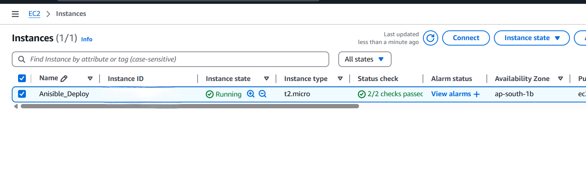
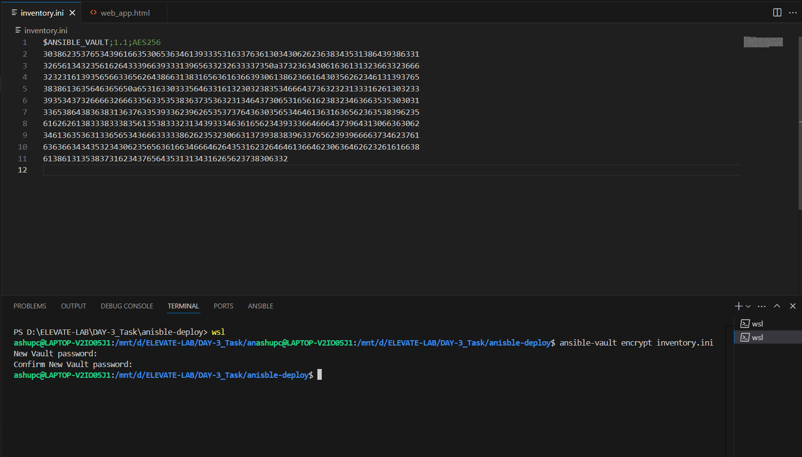
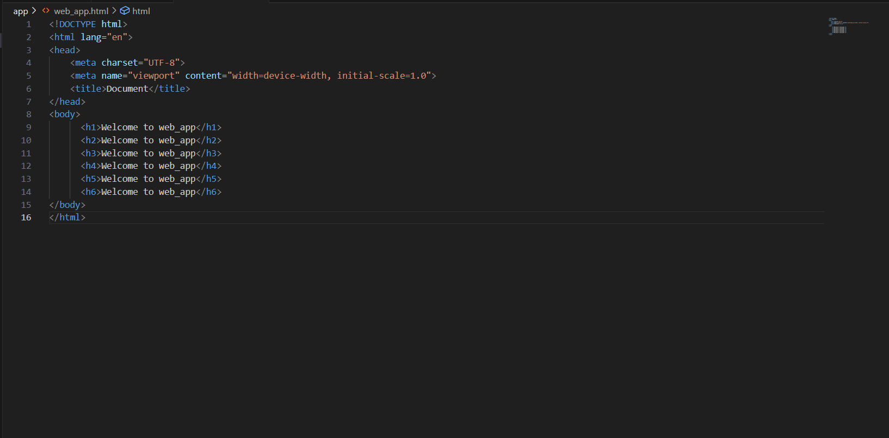
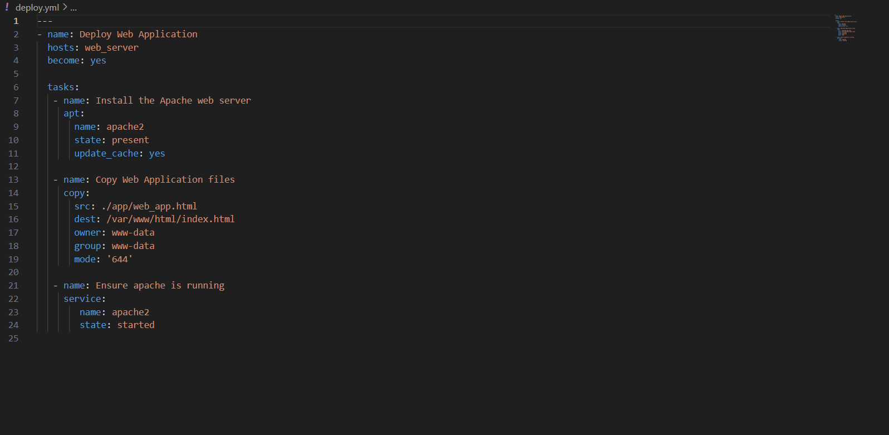
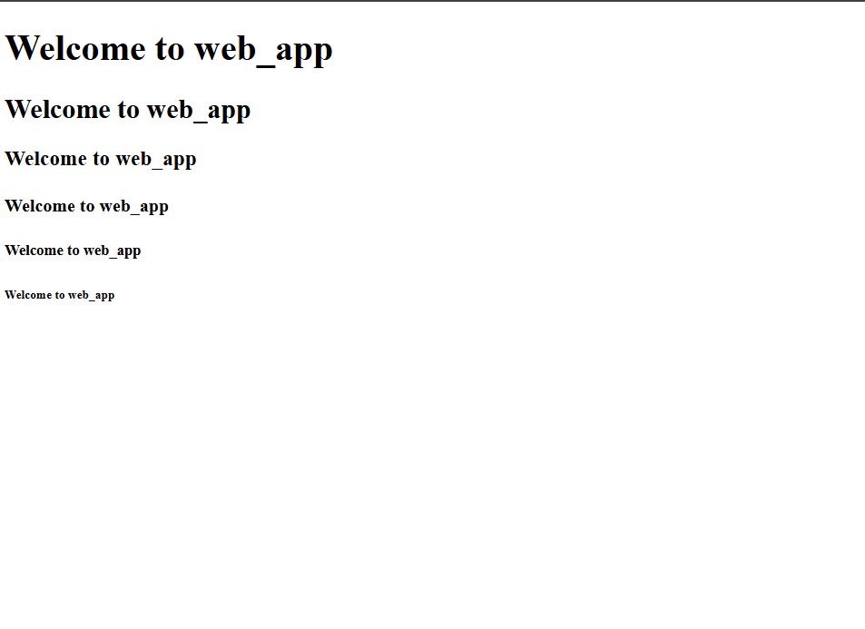

# DAY-3 Project
   

## Objective
   - Automate the deployment of a web application to a remote server using Ansible.

## STEPS -
 # 1. Launch an EC2 Instance
   - Name:Ansible_Deploy
   - AMI: Ubuntu
   - Instance type: t2.micro
   - Allow SSH and HTTP traffic from the internet
     
   - Connect with SSH
     ```bash
        ssh -i "your-key.pem" ubuntu@<EC2-Public-IP>         
   
# 2. Installation Of Ansible On Local Machine
```bash
 # Update Your System
sudo apt update && sudo apt upgrade -y

 # Add the Ansible PPA
sudo apt-add-repository --yes --update ppa:ansible/ansible

 # Install Ansible
sudo apt install ansible -y

 # Verify Installation
ansible --version
```

# 3. Folder Structure
  ```bash
      ansible-deployment/
      │── inventory.ini
      │── deploy.yml
      │── app/
      │   └── web_app.html
   ```
  

# 6. Inventory File (inventory.ini)
 ```bash
  [webserver]
  <YOUR_TARGET_SERVER_IP> ansible_user=ubuntu ansible_ssh_private_key_file=<YOUR_SSH_KEY_PATH>
  ```

  ## Using Ansible-Vault For Inventory File For Security Purpose
  ```bash
    ansible-vault encrypt inventory.ini
  ```
   ###Output
   
   
# 7. HTML File (wep_app.html)
   

# 8. Ansible Playbook (deploy.yml)
  

# 9. Command For Run Ansible-Playbook
```bash
  cd ansible-deployment/            
  ansible-playbook -i inventory.ini deploy.yml
```
# 10. Test the Deployed Application
  ```bash
     http://<YOUR_TARGET_SERVER_IP>
  ```
   ##Your Deployed Application

   
 
